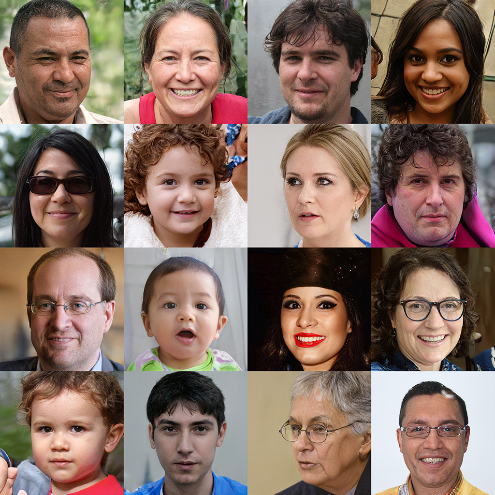
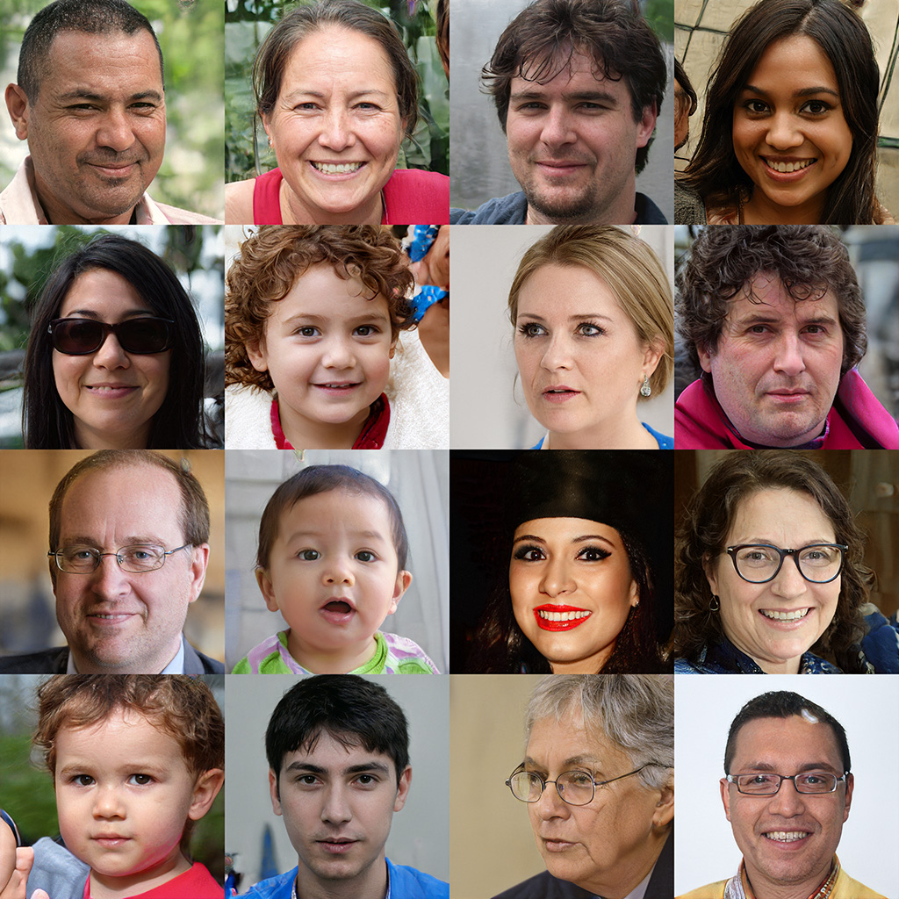
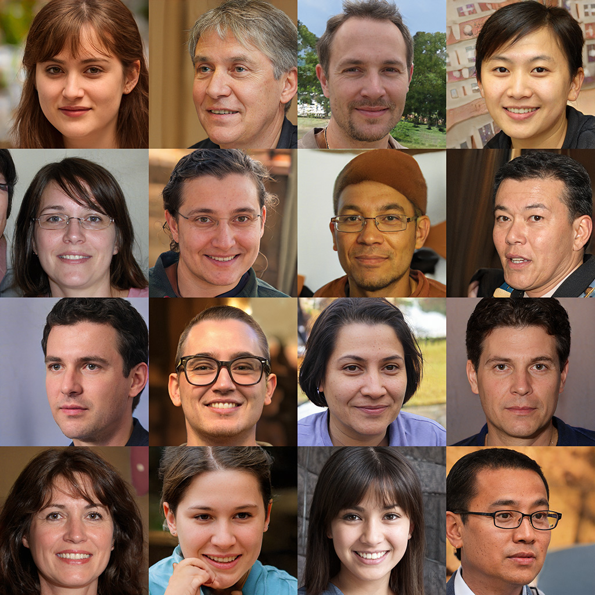
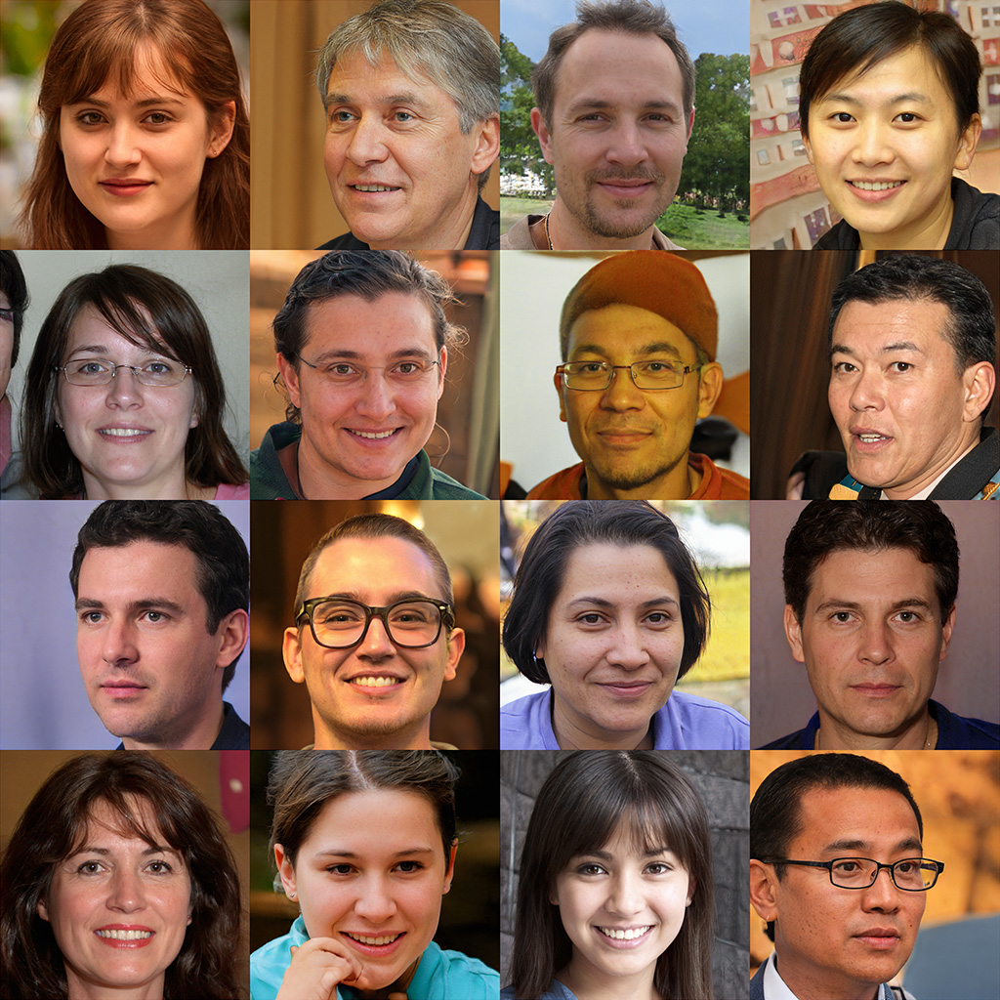

# stylegans-pytorch


**やったこと**  
著者実装の学習済みStyleGAN ([v1](https://github.com/NVlabs/stylegan),[v2](https://github.com/NVlabs/stylegan2))の
重みを変換してPyTorch再現実装のモデルで同じ出力を得るまで．

学習済みモデルからの重みの抽出も著者コードに依存しない形で実装しようと考えたが，
配布されている学習済みモデルpickleの内部で色々と参照されているので，
再現ができたかの確認や重みの変換には著者コード(TensorFlow実装)が必要である．

## 結果

- 著者オリジナル実装 StyleGAN1

- 再現実装 StyleGAN1

- 著者オリジナル実装 StyleGAN2

- 再現実装 StyleGAN2


## 入出力用ディレクトリの準備
重みの変換/再現の確認の際に以下のものが入力/出力される

- 学習済みモデル (配布されているものをダウンロード)
- 学習済みモデル (``run_tf_stylegan.py``でnumpy形式に変換)
- 出力結果写真 (``run_tf_stylegan.py``で著者実装モデルから出力)
- 入力潜在変数 (``run_tf_stylegan.py``で使用したものを記録)
- 出力結果写真 (``run_pt_stylegan.py``で本実装から出力)
- 学習済みモデル (``run_pt_stylegan.py``でnumpy形式から変換)

以下のように用意
```
export STYLEGANSDIR=/tmp/stylegans-pytorch
mkdir -p $STYLEGANSDIR
```

## 重みのダウンロード
再現実装の動作確認にはオリジナルの学習済みモデルと，
生成器の出力を保存するためのディレクトリが必要．
```
( cd $STYLEGANSDIR && curl gdrive.sh | bash -s https://drive.google.com/open?id=1MEGjdvVpUsu1jB4zrXZN7Y4kBBOzizDQ )
( cd $STYLEGANSDIR && curl gdrive.sh | bash -s https://drive.google.com/open?id=1Mgh-jglZjgksupF0XLl0KzuOqd1LXcoE )
```

**注意**  
このスクリプトは正常に動いていたが，
Googleドライブはダウンロード回数制限がある(？)ためか動かないことがあります．
GUIのブラウザから直接アクセスするほうが良いかもしれません．


## コードの用意
著者オリジナル実装と本レポジトリをダウンロード.
```
mkdir stylegans
cd stylegans
git clone https://github.com/NVlabs/stylegan.git
git clone https://github.com/NVlabs/stylegan2.git
git clone https://github.com/yuuho/stylegans-pytorch.git
```

## 環境構築
StyleGANv1のほうは著者オリジナル実装(tensorflow)も再現実装(pytorch)もcondaのみで環境構築可能．
```
conda create -y -n stylegans numpy scipy opencv tensorflow-gpu=1.14 tensorboard lmdb requests pytorch -c pytorch
conda install -y -n stylegans moviepy -c conda-forge
conda activate stylegans
```

実行した環境を残しておいた
(``conda list --export > conda_env.txt``)ので
以下で構築しても良い．
```
conda create -y -n stylegans -f conda_env.txt
```

StyleGANv2のほうは著者オリジナル実装(tensorflow)はnvccが必要なのでDockerのが良い．
rootless環境でも動くはず．rootlessやりたい場合は [インストール方法](docker_install.md) を見る．
```
docker build -t tkarras/stylegan2:latest ./stylegan2
```
再現実装(pytorch)に関してはStyleGANv1と同じ環境で動く．


## 動かす
### StyleGAN (v1)

#### tensorflow
```
cp stylegans-pytorch/run_tf_stylegan1.py stylegan/
cd stylegan
python run_tf_stylegan1.py -w $STYLEGANSDIR -o $STYLEGANSDIR
cd -
```

#### pytorch
```
python stylegans-pytorch/run_pt_stylegan1.py -w $STYLEGANSDIR -o $STYLEGANSDIR
```

### StyleGAN (v2)

#### tensorflow
著者Docker環境で実行する．
```
cp stylegans-pytorch/run_tf_stylegan2.py stylegan2/
docker run --gpus all -v $PWD/stylegan2:/workdir \
            -w /workdir -v $STYLEGANSDIR:/stylegans-pytorch \
            -it --rm tkarras/stylegan2:latest
CUDA_VISIBLE_DEVICES=0 python run_tf_stylegan2.py -w /stylegans-pytorch -o /stylegans-pytorch
exit
```

Dockerがrootlessでないなら出力したファイルを読めるようにする必要がある
```
sudo chown -R $(whoami) $STYLEGANSDIR
```

#### pytorch

```
python stylegans-pytorch/run_pt_stylegan2.py -w $STYLEGANSDIR -o $STYLEGANSDIR
```


## 特殊な部分/細かな違い

### 画像拡大操作/ブラー
StyleGANの解像度をあげるためのConvolutionについて，
基本的にはTransposedConvolutionを利用するが，
後続のBlurレイヤーとの兼ね合いもあっていくつかの実装方法が存在する．

1. ConvTransposeを3x3フィルタで pad0,stride2で行い，blurを4x4フィルタで行う方法
2. ConvTransposeを4x4フィルタで pad1,stride2で行い，blurを3x3フィルタで行う方法
3. nearest neighbour upsamplingで拡大後，Convolutionを3x3フィルタで pad1,stride1で行い，blurを3x3フィルタで行う方法

StyleGANの論文で引用している論文では信号処理的な観点からblurの必要性について説明している.
おそらくもっとも素直な実装は3である.
1と2は3に比べて高速である.
upsampleを行ってconvolutionをすると計算量的に重くなるので，
ほぼ同値な方法として3x3の畳み込みフィルタを学習させたい.
1と2はほぼ同値である.

### ノイズの入れ方
StyleGANでは全ピクセルに対してノイズを入れる．

StyleGAN1では固定ノイズは (H,W) で保持しておいて，
ノイズの重みを (C,) で保持．

StyleGAN2では固定ノイズは (H,W) で保持しておいて，
ノイズの重みを (1,) = スカラー で保持．

### 増幅
StyleGAN1とStyleGAN2で増幅処理している場所が違う．
元の実装では gain という変数に √2 などが設定されていて，
convやfcの後に強制的に特徴マップを増幅していた．

- StyleGAN1 mapping: linear -> gain -> bias
- StyleGAN2 mapping: linear -> bias -> gain
- StyleGAN1 conv : conv -> gain -> noise -> bias
- StyleGAN2 conv : conv -> noise -> bias -> gain
- StyleGAN1 toRGB : conv -> bias (増幅なし)
- StyleGAN2 toRGB : conv -> bias (増幅なし)


## TODO
- style mixingもやる
- リポジトリルートにある one_fileなスクリプトをリファクタリングする．