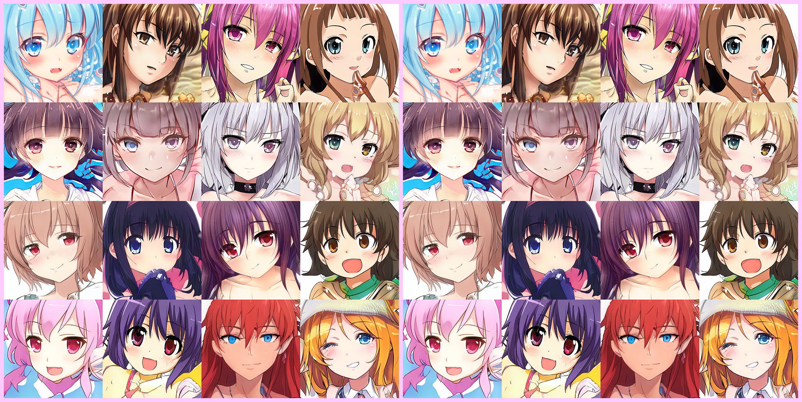
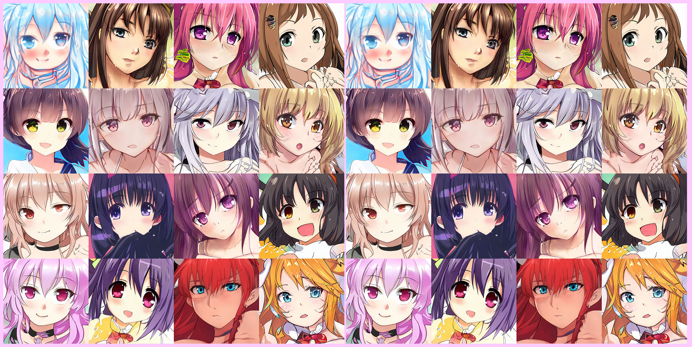
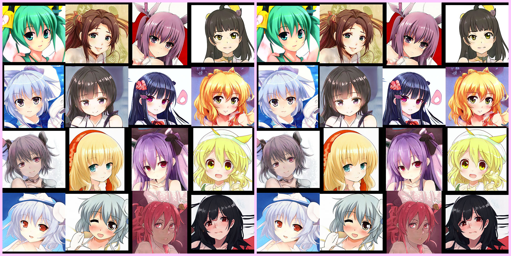
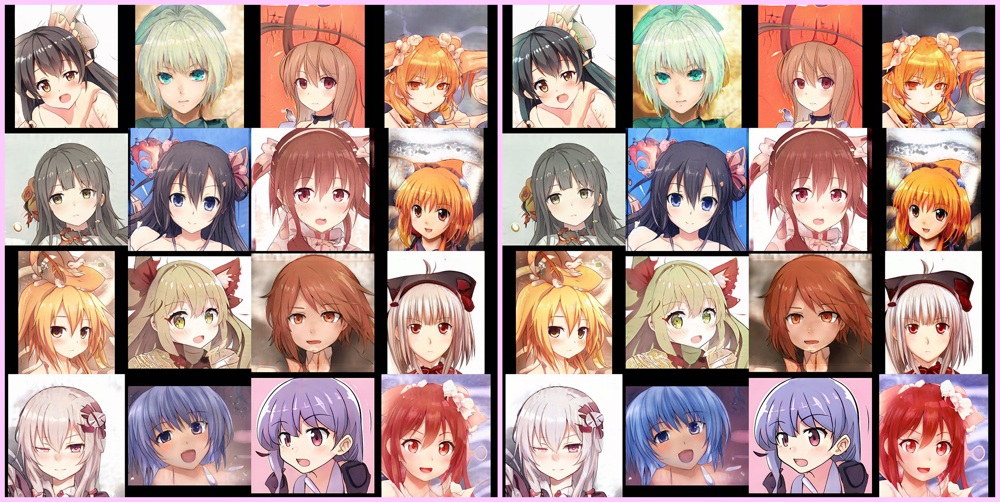

# stylegans-pytorch


**やったこと**  
著者実装の学習済みStyleGAN ([v1](https://github.com/NVlabs/stylegan),[v2](https://github.com/NVlabs/stylegan2))の
重みを変換してPyTorch再現実装のモデルで同じ出力を得るまで．

学習済みモデルからの重みの抽出も著者コードに依存しない形で実装しようと考えたが，
配布されている学習済みモデルpickleの内部で色々と参照されているので，
再現ができたかの確認や重みの変換には著者コード(TensorFlow実装)が必要である．

## 再現結果

- 著者オリジナル実装 StyleGAN1

- 再現実装 StyleGAN1

- 著者オリジナル実装 StyleGAN2

- 再現実装 StyleGAN2


## ディレクトリ構成
### はじめに
著者配布の学習済みモデルから重みを抽出するには
著者配布コードを利用するしかありません．
オリジナルのリポジトリを clone してここにあるコードをコピーして使ってください．  
依存環境が把握しやすいように，
StyleGANv1とStyleGANv2でコードを共通化せず
全てのコードを1ファイルにまとめてあります．  
同様の形式でPyTorch再現実装版も1ファイルにまとめたものを用意しておきました．  
PyTorch再現実装版はコードの共通化をしたものも用意してあり，
StyleGANv1,StyleGANv2の違う部分だけを確認しやすいようにしておきました．

**注意** : tensorflowから重みを変換するにはGPUが必要です．(4GB以上)  
GPUをお持ちでない方は [StyleGAN2による画像生成をCPU環境/TensorFlow.jsで動かす](https://memo.sugyan.com/entry/2020/02/06/005441) を参考に
色々と著者コードを書き換えて対応してください．

### ディレクトリの構成
```
- workdir/
    - stylegans-pytorch/    本リポジトリ
        - img/              : 再現結果
        - network/          : StyleGANの構造 (PyTorch) 
        - waifu/            : アニメ顔生成の学習済みモデルを動かすのに利用
        - packaged/         : StyleGANを動作させるコード (tf/pt) 1ファイルにまとめられている
        - conda_env.txt     : 動作確認済み環境
        - docker_install.md : Dockerインストール方法について
        - README.md         : 説明 (このファイル)
    - stylegan/             著者オリジナル https://github.com/NVlabs/stylegan
    - stylegan2/            著者オリジナル https://github.com/NVlabs/stylegan2
- /wherever/you/want/
    - karras2019stylegan-ffhq-1024x1024.pkl : 著者配布学習済みモデル for StyleGANv1
    - stylegan2-ffhq-config-f.pkl           : 著者配布学習済みモデル for StyleGANv2
```

### 入出力用ディレクトリ
重みの変換/再現の確認の際に以下のものが入力/出力される (以下の表はStyleGANv2のもの)

| dir type | tf | pt | summary | file name | detail |
| --- | --- | --- | ---- | ---- | ---- |
| w | IN  | -   | 学習済みモデル | ``stylegan2-ffhq-config-f.pkl`` | 配布されているものをダウンロード                |
| w | OUT | IN  | 学習済みモデル | ``stylegan2_ndarray.pkl``       | ``run_tf_stylegan2.py``でnumpy形式に変換        |
| o | OUT | IN  | 入力潜在変数   | ``latent2.pkl``                 | ``run_tf_stylegan2.py``で使用したものを記録     |
| o | OUT | IN  | 出力結果写真   | ``stylegan2_tf.png``            | ``run_tf_stylegan2.py``で著者実装モデルから出力 |
| o | -   | OUT | 出力結果写真   | ``stylegan2_pt.png``            | ``run_pt_stylegan2.py``で本実装から出力         |
| w | -   | OUT | 学習済みモデル | ``stylegan2_state_dict.pth``    | ``run_pt_stylegan2.py``でnumpy形式から変換      |

- dir type : w = weight directory, o = output directory  
それぞれ別のディレクトリを指定することができる．
以下で説明する使い方では w と o は同じディレクトリとしている．

---

## 実行方法

### 1. 入出力用ディレクトリの準備

以下のように用意
```
export STYLEGANSDIR=/wherever/you/want
mkdir -p $STYLEGANSDIR
```

### 2. 重みのダウンロード
再現実装の動作確認にはオリジナルの学習済みモデルと，
生成器の出力を保存するためのディレクトリが必要．
```
( cd $STYLEGANSDIR && curl gdrive.sh | bash -s https://drive.google.com/open?id=1MEGjdvVpUsu1jB4zrXZN7Y4kBBOzizDQ )
( cd $STYLEGANSDIR && curl gdrive.sh | bash -s https://drive.google.com/open?id=1Mgh-jglZjgksupF0XLl0KzuOqd1LXcoE )
```

**注意**  
このスクリプトは正常に動いていたが，
Googleドライブはダウンロード回数制限がある(？)ためか動かないことがあります．
GUIのブラウザから直接アクセスするほうが良いかもしれません．


### 3. コードの用意
著者オリジナル実装と本レポジトリをダウンロード.
```
mkdir stylegans
cd stylegans
git clone https://github.com/NVlabs/stylegan.git
git clone https://github.com/NVlabs/stylegan2.git
git clone https://github.com/yuuho/stylegans-pytorch.git
```

### 4. 環境構築
StyleGANv1のほうは著者オリジナル実装(tensorflow)も再現実装(pytorch)もcondaのみで環境構築可能．
```
conda create -y -n stylegans numpy scipy opencv tensorflow-gpu=1.14 tensorboard lmdb requests pytorch -c pytorch
conda install -y -n stylegans moviepy -c conda-forge
conda activate stylegans
```

実行した環境を残しておいた
(``conda list --export > conda_env.txt``)ので
以下で構築しても良い．
```
conda create -y -n stylegans -f conda_env.txt
```

StyleGANv2のほうは，著者オリジナル実装(tensorflow)は
CUDAコードが含まれておりnvccによるコンパイル環境が必要なのでDockerのが良い．
rootless環境でも動くはず．rootlessやりたい場合は [インストール方法](docker_install.md) を見る．

Dockerイメージのビルドは ``workdir``で
```
docker build -t tkarras/stylegan2:latest ./stylegan2
```
再現実装(pytorch)に関してはStyleGANv1と同じ環境で動く．


### 5. 動かす
#### 5.1. StyleGAN (v1) tensorflow
``workdir``で
```
cp stylegans-pytorch/packaged/run_tf_stylegan1.py stylegan/
cd stylegan
python run_tf_stylegan1.py -w $STYLEGANSDIR -o $STYLEGANSDIR
cd -
```

#### 5.2. StyleGAN (v1) pytorch
``workdir``で
```
python stylegans-pytorch/packaged/run_pt_stylegan1.py -w $STYLEGANSDIR -o $STYLEGANSDIR
```

#### 5.3. StyleGAN (v2) tensorflow
著者Docker環境で実行する．
``workdir``で
```
cp stylegans-pytorch/packaged/run_tf_stylegan2.py stylegan2/
docker run --gpus all -v $PWD/stylegan2:/workdir \
            -w /workdir -v $STYLEGANSDIR:/stylegans-pytorch \
            -it --rm tkarras/stylegan2:latest
CUDA_VISIBLE_DEVICES=0 python run_tf_stylegan2.py -w /stylegans-pytorch -o /stylegans-pytorch
exit
```

Dockerがrootlessでないなら出力したファイルを読めるようにする必要がある
```
sudo chown -R $(whoami) $STYLEGANSDIR
```

#### 5.4. StyleGAN (v2) pytorch

``workdir``で
```
python stylegans-pytorch/packaged/run_pt_stylegan2.py -w $STYLEGANSDIR -o $STYLEGANSDIR
```

---

## 特殊な部分/細かな違い

### 1. 画像拡大操作/ブラー
StyleGANの解像度をあげるためのConvolutionについて，
基本的にはTransposedConvolutionを利用するが，
後続のBlurレイヤーとの兼ね合いもあっていくつかの実装方法が存在する．

1. ConvTransposeを3x3フィルタで pad0,stride2で行い，blurを4x4フィルタで行う方法
2. ConvTransposeを4x4フィルタで pad1,stride2で行い，blurを3x3フィルタで行う方法
3. nearest neighbour upsamplingで拡大後，Convolutionを3x3フィルタで pad1,stride1で行い，blurを3x3フィルタで行う方法

StyleGANの論文で引用している論文では信号処理的な観点からblurの必要性について説明している.
おそらくもっとも素直な実装は3である.
1と2は3に比べて高速である.
upsampleを行ってconvolutionをすると計算量的に重くなるので，
ほぼ同値な方法として3x3の畳み込みフィルタを学習させたい.
1と2はほぼ同値である.

### 2. ノイズの入れ方
StyleGANでは全ピクセルに対してノイズを入れる．

StyleGAN1では固定ノイズは (H,W) で保持しておいて，
ノイズの重みを (C,) で保持．

StyleGAN2では固定ノイズは (H,W) で保持しておいて，
ノイズの重みを (1,) = スカラー で保持．

### 3. 増幅
StyleGAN1とStyleGAN2で増幅処理している場所が違う．
元の実装では gain という変数に √2 などが設定されていて，
convやfcの後に強制的に特徴マップを増幅していた．

- StyleGAN1 mapping: linear -> gain -> bias
- StyleGAN2 mapping: linear -> bias -> gain
- StyleGAN1 conv : conv -> gain -> noise -> bias
- StyleGAN2 conv : conv -> noise -> bias -> gain
- StyleGAN1 toRGB : conv -> bias (増幅なし)
- StyleGAN2 toRGB : conv -> bias (増幅なし)


---

## Waifu

著者の学習させたFFHQモデルが動作するのは確認したので第三者によって学習させたモデルが動くか試してみます．
[Making Anime Faces With StyleGAN - Gwern](https://www.gwern.net/Faces) に
二次元キャラクター生成用の学習済みモデルがあるのでこれを使います．

### モデルのダウンロード・配置
4つの学習済みモデルが配布されているのを見つけたのでこれで試します．

1. Face StyleGANv1 (This Waifu Does Not Exist v1) 512px Danbooru2017 (train 218,794)  
[2019-02-26-stylegan-faces-network-02048-016041.pkl](https://mega.nz/#!aPRFDKaC!FDpQi_FEPK443JoRBEOEDOmlLmJSblKFlqZ1A1XPt2Y)
2. Face StyleGANv1 512px  
[2019-03-08-stylegan-animefaces-network-02051-021980.pkl.xz](https://mega.nz/#!vawjXISI!F7s13yRicxDA3QYqYDL2kjnc2K7Zk3DwCIYETREmBP4)
3. Portrait StyleGANv1 512px  
[2019-04-30-stylegan-danbooru2018-portraits-02095-066083.pkl](https://mega.nz/#!CRtiDI7S!xo4zm3n7pkq1Lsfmuio1O8QPpUwHrtFTHjNJ8_XxSJs)
4. Portrait StyleGANv2 (This Waifu Does Not Exist v3) 512px   
[2020-01-11-skylion-stylegan2-animeportraits-networksnapshot-024664.pkl.xz](https://mega.nz/#!PeIi2ayb!xoRtjTXyXuvgDxSsSMn-cOh-Zux9493zqdxwVMaAzp4)

StyleGANv1では (1) Faceを学習させたもの，(2) そこから更に学習させたもの，(3) Portraitを学習させたもの，の3つがあるようです．  
StyleGANv2では (4) Portraitを学習させたもの，が1つあります．
Faceはクローズ・アップぐらいの構図，Portraitはアップ・ショットぐらいの構図のようです．

圧縮されているものは解凍して以下のように配置します．
```
- /wherever/you/want/
    - 2019-02-26-stylegan-faces-network-02048-016041.pkl
    - 2019-03-08-stylegan-animefaces-network-02051-021980.pkl
    - 2019-04-30-stylegan-danbooru2018-portraits-02095-066083.pkl
    - 2020-01-11-skylion-stylegan2-animeportraits-networksnapshot-024664.pkl
```

### 重みの変換・画像の生成

``waifu`` ディレクトリに雑に書き換えたものを置いておきました．

#### tensorflowで重みを変換

``workdir`` で
```
cp stylegans-pytorch/waifu/converter.py stylegan/
cd stylegan
python converter.py 1 face_v1_1 -w $STYLEGANSDIR -o $STYLEGANSDIR
python converter.py 1 face_v1_2 -w $STYLEGANSDIR -o $STYLEGANSDIR
python converter.py 1 portrait_v1 -w $STYLEGANSDIR -o $STYLEGANSDIR
cd -

cp stylegans-pytorch/waifu/converter.py stylegan2/
docker run --gpus all -v $PWD/stylegan2:/workdir \
            -w /workdir -v $STYLEGANSDIR:/stylegans-pytorch \
            -it --rm tkarras/stylegan2:latest
CUDA_VISIBLE_DEVICES=0 python converter.py 2 portrait_v2 -w /stylegans-pytorch -o /stylegans-pytorch
exit
sudo chown -R $(whoami) $STYLEGANSDIR
```

#### pytorchで読み込んで画像生成

``workdir`` で
```
python stylegans-pytorch/waifu/run_pt_stylegan.py 1 face_v1_1 -w $STYLEGANSDIR -o $STYLEGANSDIR
python stylegans-pytorch/waifu/run_pt_stylegan.py 1 face_v1_2 -w $STYLEGANSDIR -o $STYLEGANSDIR
python stylegans-pytorch/waifu/run_pt_stylegan.py 1 portrait_v1 -w $STYLEGANSDIR -o $STYLEGANSDIR
python stylegans-pytorch/waifu/run_pt_stylegan.py 2 portrait_v2 -w $STYLEGANSDIR -o $STYLEGANSDIR
```

### 結果
うまくいったようです．

左: オリジナル出力, 右: 再現出力

- (1) anime_face_v1_1


- (2) anime_face_v1_2


- (3) anime_portrait_v1


- (4) anime_portrait_v2


## TODO
- style mixingもやる
- StyleGANv2 の色味が違う原因を特定
- projection
- train
